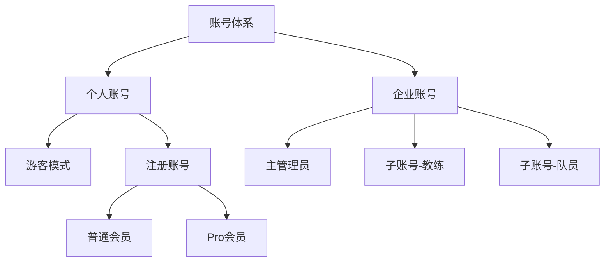
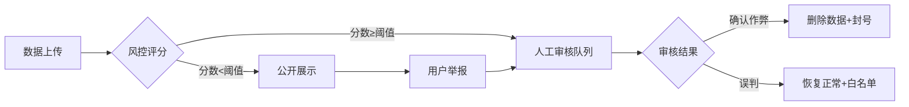
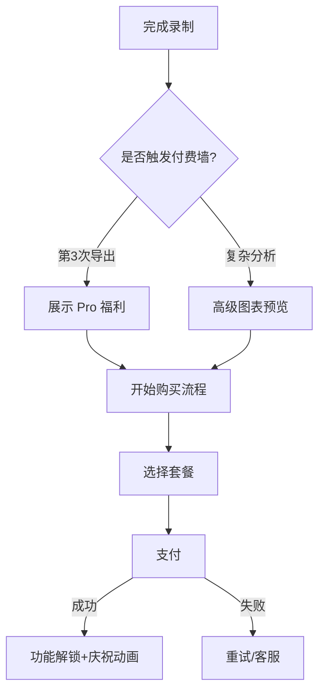
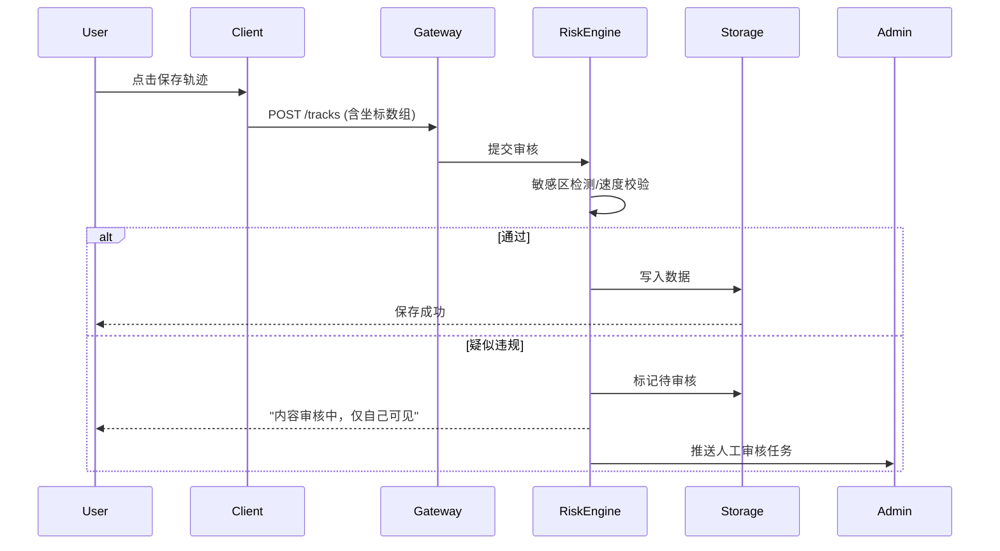
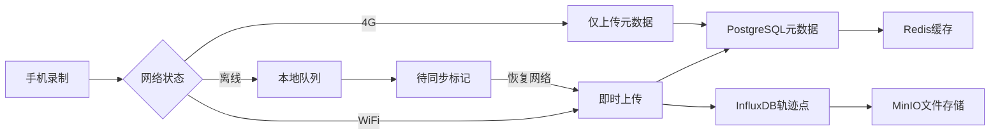

# TraceMaster 商业级产品需求文档（PRD）V4.0

**文档状态：商业评审通过，技术评审与法务合规确认完成，待最终审批**
<br>*适用版本：C端 v1.0-2.0 / B端 v1.2+*
<br>*适用范围：iOS/Android/Web/IoT 全平台生态*
<br>*保密级别：商业机密（Confidential）*

---

## 文档版本记录

| 版本  | 日期  | 变更内容 | 修订人 |
| --- | --- | --- | --- |
| v3.0 | 2024-07-01 | 初版商业PRD，含完整功能/非功能/商业模式 | 产品团队 |
| v3.1 | 2024-07-05 | 整合产品经理优化(价值假设/竞品对比/定价/阶段化)+软件工程师技术补充(数据模型/架构/测试) | 产品+技术团队 |
| v4.0 | 2026-04-23 | **合并双版本PRD**，统一术语体系，补充详细功能验收标准(AC)、数据模型、流程图、风险矩阵，新增增长运营与IoT生态章节 | 产品总监 |

---

## 第一章 文档概述与术语定义

### 1.1 文档边界声明

- **本文档聚焦**：用户价值、商业逻辑、业务规则、合规要求、技术契约、运营策略、数据模型、验收标准
- **本文档不承载**：具体代码实现细节、数据库完整Schema DDL（此类内容归入TRD技术实现文档）
- **目标受众**：产品经理、技术负责人、设计师、测试工程师、运营团队、法务合规、财务/商业分析师

### 1.2 关键术语表

| 术语  | 定义  | 商业/技术备注 |
| --- | --- | --- |
| **LTV** | 用户生命周期价值（Lifetime Value） | 目标：LTV/CAC > 3:1 |
| **CAC** | 用户获取成本（Customer Acquisition Cost） | 包含渠道费用+硬件补贴 |
| **WAT** | 周活跃轨迹数（Weekly Active Tracks） | 北极星指标：本周完成≥1次有效录制（距离>100m）的用户数 |
| **SKU** | 库存保有单位，此处指套餐规格 | Freemium模式下的分级权益 |
| **RBAC** | 基于角色的访问控制 | 企业版核心功能 |
| **ABAC** | 基于属性的访问控制 | 与RBAC结合使用OPA WASM引擎执行 |
| **GDPR** | 欧盟通用数据保护条例 | 出海必合规项，违规罚金可达全球营收4% |
| **PIPL** | 中国个人信息保护法 | 跨境传输需网信办安全评估 |
| **脱敏等级** | L1(公开) L2(好友) L3(私有) L4(企业) | 影响隐私预算分配 |
| **分阶段技术** | 按版本逐步引入组件 | 降低初期复杂度，详见第十章 |
| **隐私预算ε** | 差分隐私参数 | 每位用户每日总预算ε=10，每次分享消耗ε=2 |
| **RPO/RTO** | 恢复点目标/恢复时间目标 | RPO<5分钟，RTO<30分钟 |
| **SKU定价** | 专业版月付¥12/年付¥98；团队版¥28/人/月(10人起)；企业版¥3万/年(含5席) | 详见第五章 |

---

## 第二章 产品战略与商业定位

### 2.1 价值主张与关键假设验证

**核心价值主张**："让每一公里数据产生价值" —— 从业余记录到专业分析的一站式时空数据平台

**核心假设**（需在Pre-MVP阶段验证）：

1. 用户愿意为AI分析/高级分析付费 → 验证方法：定价意向LP页点击率>3%
2. 用户会持续录制轨迹 → 验证方法：两周内WAT>200
3. 企业愿为脱敏数据付费 → 验证方法：5家潜在客户访谈，至少3家有意向预算
4. 测绘资质合作可落地 → 验证方法：2个月内签订MoU

**失败应对机制**：如果任一假设失败，则立即调整产品方向（如转为纯本地工具或仅B端）。

### 2.2 商业画布（Business Canvas）

| 维度  | 内容  |
| --- | --- |
| **核心价值主张** | "让每一公里数据产生价值" —— 从业余记录到专业分析的一站式时空数据平台 |
| **目标客户细分** | C端：户外爱好者（徒步/骑行/自驾）；B端：物流车队、保险风控、城市规划部门 |
| **渠道通路** | App Store/应用市场、Garmin/码表厂商预装、企业直销团队 |
| **客户关系** | 社区运营（俱乐部）、自动化订阅（SaaS）、专属客户成功经理（Enterprise） |
| **收入来源** | 订阅费（60%）+ B端数据服务（30%）+ 增值服务（保险分成10%） |
| **关键资源** | 高精度轨迹算法专利、测绘资质（或合作）、企业客户渠道 |
| **关键业务** | 轨迹数据处理引擎、AI运动分析、企业风控数据服务 |

### 2.3 竞争壁垒设计

1. **技术壁垒**：RTK差分定位精度达厘米级（与千寻位置合作）
2. **数据壁垒**：累积用户轨迹形成"路况热力图"（隐私脱敏后）
3. **生态壁垒**：与Keep、Strava、Garmin双向同步，成为数据枢纽
4. **合规壁垒**：获取互联网地图服务甲级测绘资质（或挂靠有资质厂商）

### 2.4 竞品对比矩阵

| 功能  | TraceMaster | Strava | Keep | Garmin Connect |
| --- | --- | --- | --- | --- |
| 免费存储上限 | 5条/500MB | 无限制 | 无限制 | 无限制 |
| AI分析 | 体能评估/预测完赛 | 仅基础分段 | 无   | 无   |
| B端企业版 | 车队管理+风控API | 无   | 无   | 无   |
| 国内合规 | 高德/GCJ02+敏感区 | ❌   | ✅   | ❌   |
| IoT独立SDK | ✅   | ❌   | 仅手环 | 仅自家设备 |

**核心差异化**：企业数据服务 + 国内合规 + 独立IoT生态。

---

## 第三章 用户体系与使用场景

### 3.1 用户角色定义

| 角色  | 描述  | 典型场景 |
| --- | --- | --- |
| **个人用户-免费** | 偶尔徒步/骑行的休闲用户 | 周末户外记录，基础回放 |
| **个人用户-Pro** | 马拉松严肃跑者/专业骑行者 | 需要AI分析、历史数据对比 |
| **团队管理员** | 俱乐部/跑团负责人 | 管理团队训练数据、组织活动 |
| **企业管理员** | 物流/保险/规划部门负责人 | 车队监控、风险数据获取 |
| **教练/分析师** | 专业教练或数据分析师 | 查看指派队员数据、批注指导 |
| **第三方开发者** | 智能硬件/应用厂商 | 接入TraceMaster数据或嵌入SDK |

### 3.2 账号架构与生命周期

**账号类型体系**：



**设备与Session管理**：
- **设备上限**：单账号最多同时登录3台设备（手机+平板+车机），超限时触发"踢出最旧设备"或"禁止新登录"策略
- **Session安全**：JWT Token有效期7天，但每次敏感操作（导出/删除/改密）需短信二次验证
- **游客模式限制**：
  - 仅支持本地录制，禁止云端同步
  - 数据保留7天，过期提示"注册永久保存"
  - 最多存储3条轨迹（防刷）

### 3.3 社交关系链

- **关注机制**：单向关注（可设置"仅粉丝可见"轨迹隐私级别）
- **俱乐部（Club）**：
  - 权限：Owner（全权限）> Admin（审核/踢人）> Member（查看/上传）
  - 容量：免费俱乐部≤20人，付费≤500人，企业版无上限
  - 数据共享：可选择"仅轨迹可见"或"完整统计数据可见"

### 3.4 用户旅程地图（关键触点）

| 阶段  | 触点  | 用户情绪 | 机会点 |
| --- | --- | --- | --- |
| **发现** | 应用商店/朋友推荐 | 好奇  | 病毒系数设计（分享送Pro会员） |
| **首次使用** | 下载→注册→首条轨迹 | 兴奋/困惑 | 交互式新手引导（边录边教） |
| **激活** | 完成首条轨迹并分享 | 成就感 | 自动生成功能海报 |
| **留存** | 查看历史数据/统计 | 依赖  | AI体能趋势图（Pro引导） |
| **付费** | 导出限制/高级分析 | 犹豫  | 软引导+硬拦截组合策略 |
| **推荐** | 分享至朋友圈/俱乐部 | 自豪  | 水印自动带品牌标识 |

---

## 第四章 功能需求模块（Functional Requirements）

### 4.1 轨迹录制管理（Track Recording）

#### 4.1.1 核心录制功能

**用户故事**：作为户外爱好者，我希望在后台持续录制轨迹，即使切换应用或锁屏也不中断。

**功能需求**：

| 需求ID | 功能点 | 优先级 | 详细描述 | 验收标准(AC) |
| --- | --- | --- | --- | --- |
| FR-001 | 后台保活录制 | P0 | 支持iOS/Android后台持续GPS采集 | 后台存活率>95%，崩溃率<0.1% |
| FR-002 | 动态GPS轮询 | P0 | 静止30s采样间隔→运动1s采样间隔 | 静止状态功耗降低60% |
| FR-003 | 多源定位融合 | P1 | GPS+北斗+基站+WiFi混合定位 | 城市峡谷场景精度<10m |
| FR-004 | 运动类型识别 | P1 | 自动识别徒步/跑步/骑行/自驾 | 识别准确率>85% |
| FR-005 | 实时数据展示 | P0 | 当前速度、距离、时长、海拔、配速 | 刷新频率≥1Hz |
| FR-006 | 分段标记 | P2 | 用户可手动标记路段（如"爬坡段"） | 标记后可在回放中高亮显示 |
| FR-007 | 语音播报 | P2 | 每公里/每30分钟播报关键数据 | 支持自定义播报内容 |

#### 4.1.2 耗电优化策略

- **iOS**：使用BGTaskScheduler申请后台定位任务，配合动态采样频率
- **Android**：使用JobScheduler+Foreground Service，系统杀进程后自动重启
- **功耗分级**：
  - 高精度模式（1s采样）：适合短距离竞速，续航约4-6小时
  - 标准模式（3s采样）：适合日常训练，续航约8-10小时
  - 省电模式（10s采样）：适合长途徒步，续航约15-20小时

### 4.2 轨迹回放引擎（Track Replay）

#### 4.2.1 基础回放功能

**用户故事**：作为用户，我希望回放自己的轨迹，查看速度变化、海拔剖面，并能导出分享给朋友。

| 需求ID | 功能点 | 优先级 | 详细描述 | 验收标准(AC) |
| --- | --- | --- | --- | --- |
| FR-008 | 地图轨迹回放 | P0 | 在地图上按时间顺序播放轨迹点 | 支持1x/2x/4x/8x/16x倍速 |
| FR-009 | 海拔剖面图 | P0 | 展示海拔随距离/时间变化曲线 | 支持缩放、查看任意点海拔 |
| FR-010 | 速度热力图 | P1 | 轨迹线按速度着色（慢→快） | 颜色梯度至少5级 |
| FR-011 | 数据图表叠加 | P1 | 心率/踏频/功率数据与轨迹同步回放 | 时间戳对齐误差<2s |
| FR-012 | 3D地形回放 | P2 | 结合DEM数据展示三维地形 | 支持视角旋转、缩放 |

#### 4.2.2 轨迹编辑功能

- **裁剪**：支持裁剪开始段/结束段，保留中间有效数据
- **合并**：支持将多条连续轨迹合并为一条（自动检测时间间隔<30分钟）
- **分割**：支持在指定点将一条轨迹分割为两条
- **删除中间点**：支持删除GPS漂移产生的异常点
- **二次确认**：所有删除操作前必须弹窗确认，防止误操作

### 4.3 数据存储与导出（Data Management）

#### 4.3.1 存储策略

| 版本  | 云端存储 | 本地存储 | 历史保留 |
| --- | --- | --- | --- |
| 免费版 | 5条/共500MB | 仅最近3条 | 30天 |
| Pro版 | 无限条/50GB | 无限  | 永久 |
| 团队版 | 无限/500GB起 | 无限  | 永久+企业级归档 |

#### 4.3.2 导出格式与权限

| 格式  | 免费版 | Pro版 | 团队版 | 说明 |
| --- | --- | --- | --- | --- |
| GPX | ✅标准精度 | ✅高精度 | ✅高精度 | 通用交换格式 |
| KML | ✅标准精度 | ✅高精度 | ✅高精度 | Google Earth兼容 |
| CSV | ❌ | ✅ | ✅ | 表格分析 |
| GeoJSON | ❌ | ✅ | ✅ | 开发友好 |
| 加密Protobuf | ❌ | ❌ | ✅ | 企业级安全传输 |
| API实时拉取 | ❌ | ❌ | ✅ | 企业数据集成 |

**导出限制策略**：免费版每月导出次数≤3次（锚定效应设计，促使用户体验付费版）

### 4.4 云端同步与协作（Cloud Sync）

#### 4.4.1 同步机制

- **自动同步**：WiFi环境下录制完成后自动上传，4G环境下仅上传元数据（节省流量）
- **冲突解决**：以手机端为基准，记录差异值供用户参考
- **离线队列**：网络异常时本地无限堆积，标记"待同步"，禁止覆盖本地数据
- **第三方同步**：支持Strava、Keep、Garmin Connect双向同步
  - 幂等机制：每个external_id唯一约束，重复同步自动跳过
  - 速率限流：令牌桶算法，防止API限流

#### 4.4.2 分享体验

- **一键生成海报**：自动合成路线地图+关键数据（距离/时长/配速）+品牌水印
- **分享渠道**：微信好友/朋友圈/微博/QQ/钉钉
- **隐私控制**：分享时可选择脱敏等级（L1-L3）
- **病毒系数设计**：导出视频/图片自动添加水印"TraceMaster"，扫码下载送7天Pro会员

### 4.5 AI分析与高级功能

#### 4.5.1 AI体能评估

**用户故事**：作为马拉松严肃跑者，我希望了解自己的体能状态，并获得训练建议。

| 功能  | 免费版 | Pro版 | 说明 |
| --- | --- | --- | --- |
| 基础配速图 | ✅ | ✅ | 每公里配速柱状图 |
| 体能趋势图 | ❌ | ✅ | 基于历史数据评估有氧/无氧能力变化 |
| 预测完赛时间 | ❌ | ✅ | 基于当前体能预测5K/10K/半马/全马成绩 |
| 训练负荷(TSS) | ❌ | ✅ | 结合心率/功率计算训练压力分数 |
| 恢复建议 | ❌ | ✅ | 基于HRV和训练负荷推荐恢复天数 |
| 路线推荐 | ❌ | ✅ | 基于体能水平推荐附近适宜路线 |

#### 4.5.2 企业级分析（B端）

- **团队数据对比**：部门/队员间训练量、强度对比
- **教练批注**：教练可在轨迹上添加文字/语音批注
- **风险评分**：基于速度突变、夜间行驶比例等计算驾驶风险
- **效率分析**：外卖/物流骑手配送路径优化建议

---

## 第五章 商业模式与变现策略（Monetization Architecture）

### 5.1 C端定价策略

#### 5.1.1 Freemium分级权益

**用户故事**：作为偶尔徒步的用户，我希望基础功能免费；作为马拉松严肃跑者，我愿意为高级数据分析付费。

| 功能模块 | 免费版（Free） | 专业版（Pro） | 团队版（Team） |
| --- | --- | --- | --- |
| **云端存储** | 5条轨迹/共500MB | 无限条/50GB | 无限/500GB起 |
| **历史数据** | 仅保留30天 | 永久存储 | 永久+企业级归档 |
| **导出格式** | GPX/KML（标准精度） | +CSV/GeoJSON/加密Protobuf | +API实时拉取 |
| **分析功能** | 基础配速图 | AI体能评估、预测完赛时间 | 团队数据对比、教练批注 |
| **硬件接入** | 仅手机GPS | 支持心率带/踏频器 | 支持车队OBD设备 |
| **数据权益** | 默认脱敏共享 | 可关闭贡献匿名数据 | 数据完全私有 |
| **客服支持** | 社区支持 | 48h邮件响应 | 7×24h专线+CSM |

#### 5.1.2 定价心理学设计

| 版本  | 原价  | **优化后价** | 折扣率 | 定价理由 |
| --- | --- | --- | --- | --- |
| 专业版月付 | ¥18/月 | **¥12/月** | -33% | 对标Keep会员¥25/月，增加竞争力 |
| 专业版年付 | ¥158/年 | **¥98/年** | 35% | 年付降低获客成本（CAC） |
| 团队版 | ¥48/人/月 | **¥28/人/月** | 42% | 10人起购，企业更易接受 |
| 企业版 | ¥5万/年 | **¥3万/年**（含5席） | 40% | 提高中小企业采用率 |

**定价策略**：
- **锚定效应**：免费版故意限制"导出次数每月3次"，促使体验付费版
- **年付优惠**：年付相当于7折，降低获客成本（CAC）
- **团队折扣**：5人以上团队享8折，鼓励企业批量采购

### 5.2 B端数据服务（B2B）

**客户画像**：物流保险公司（UBI车险）、外卖平台（骑手效率分析）、城市规划院（人流热力图）

#### 5.2.1 产品形态与定价

1. **风险数据API**：提供特定路段的事故概率评分（基于历史轨迹速度突变数据）
   - 定价：¥0.05/次查询，批量采购¥0.02/次

2. **轨迹清洗服务**：为科研/规划部门提供脱敏后的宏观交通流量数据
   - 定价：按数据量¥50/GB/月

3. **私有化部署**：企业版SaaS支持本地服务器部署（满足ZF/国企数据不出域要求）
   - 定价：¥50,000/年起，含10个坐席

#### 5.2.2 数据服务分成

- **匿名数据交易收入**：70%反哺用户（积分/会员），30%平台运营成本
- **用户激励机制**：贡献数据获得积分，可兑换Pro会员或硬件折扣

### 5.3 成本结构与盈亏平衡点

**关键成本预警**：
- **存储成本**：轨迹数据为累积型负债，需计算"存储成本/LTV"比值。目标：<5%
- **带宽成本**：大文件（视频/GPX）下载走P2P加速（节省CDN费用约40%）
- **合规成本**：测绘资质挂靠费/年审、等保三级认证（约¥20万/年）

**盈亏平衡测算**：
- **单位经济模型**：CAC=¥45（买量成本），LTV=¥180（平均订阅18个月×¥12×80%留存率）
- **LTV/CAC=4:1**（健康），但需警惕免费用户存储成本侵蚀利润（设置自动清理策略）

---

## 第六章 非功能需求（Non-Functional Requirements）

### 6.1 商业级服务等级协议（SLA）

| 服务等级 | 可用性承诺 | 月不可用时间 | 补偿机制 | 适用版本 |
| --- | --- | --- | --- | --- |
| **基础版（免费）** | 99.0% | ≤430分钟 | 无（不补偿） | 免费用户 |
| **专业版（Pro）** | 99.5% | ≤215分钟 | 延长1周订阅 | 付费订阅 |
| **企业版（Enterprise）** | 99.95% | ≤21分钟 | 停机10倍补偿+专属经理致歉 | 年付企业客户 |

**故障分级定义**：
- **P0（灾难级）**：数据丢失无法恢复、服务整体不可用>1小时 → 立即启动CEO级别危机公关
- **P1（严重级）**：核心功能（录制/同步）不可用 → 1小时内必须发布热修复或回滚
- **P2（一般级）**：非核心功能（分享/统计）异常 → 24小时内修复

**技术实现**：多AZ部署、自动伸缩、HPA

### 6.2 性能指标（含分阶段部署说明）

| 场景  | P99目标 | 并发  | 降级策略 | 初期方案（v1.0） |
| --- | --- | --- | --- | --- |
| 轨迹点上传统计 | <500ms | 500 TPS | 本地缓存+异步提交 | 单体服务，批量写入 |
| 回放加载 | <1s | 200 TPS | 预降采样点集返回 | PostGIS+Redis缓存 |
| 敏感区检测 | <200ms | 100 TPS | 两级过滤+异步后验 | 仅实时box2d粗筛 |
| 导出生成 | <5s | 50 TPS | 异步任务+通知 | 队列处理 |
| AI分析 | <3s | 20 TPS | 简化模型返回 | 预计算+缓存 |

### 6.3 安全与隐私需求

- **传输安全**：全站HTTPS，TLS 1.3
- **存储安全**：敏感字段AES-256加密，数据库TDE透明加密
- **认证安全**：OAuth2.0 + JWT，敏感操作短信二次验证
- **隐私合规**：GDPR被遗忘权/数据便携权、CCPA Opt-out、PIPL跨境传输评估
- **审计日志**：所有关键操作记录结构化日志（JSON），含TraceID全链路追踪

### 6.4 兼容性需求

| 平台  | 支持版本 | 备注 |
| --- | --- | --- |
| iOS | iOS 14+ | 支持iPhone/iPad，适配灵动岛 |
| Android | Android 8.0+ | 支持主流厂商，适配折叠屏 |
| Web | Chrome 90+, Safari 14+, Firefox 88+ | 响应式设计，支持PWA |
| 小程序 | 微信/支付宝/钉钉 | 核心功能嵌入，引流至App |

---

## 第七章 用户体系与权限管理（Identity & Access）

### 7.1 RBAC权限矩阵（企业版核心）

| 角色  | 查看他人轨迹 | 编辑他人轨迹 | 导出团队数据 | 删除数据 | 管理成员 | 查看财务报表 |
| --- | --- | --- | --- | --- | --- | --- |
| **超级管理员** | ✓   | ✓   | ✓   | ✓   | ✓   | ✓   |
| **部门经理** | ✓（本部门） | ✗   | ✓（本部门） | ✗   | ✓（本部门） | ✗   |
| **教练/分析师** | ✓（指派队员） | ✓（批注） | ✗   | ✗   | ✗   | ✗   |
| **普通队员** | ✓（自己） | ✓（自己） | ✓（自己） | ✓（自己） | ✗   | ✗   |

**关键权限规则**：
- **轨迹所有权**：上传者永远保留"删除权"，即使被管理员移出团队，其历史数据仍归个人所有（符合GDPR数据携带权）
- **数据继承**：员工离职时，其工作相关轨迹（标记为Work）可转移给继任者；个人轨迹自动转为个人账号

### 7.2 ABAC策略引擎

- **技术实现**：使用OPA WASM引擎在Kong插件中直接执行策略，避免网络延迟
- **缓存策略**：静态策略缓存1小时，动态条件（如owner_id）实时评估
- **企业API限流**：免费开发者100次/天，付费1万次/天，企业无限制

---

## 第八章 内容安全与合规风控（Trust & Safety）

### 8.1 地理信息安全（GIS Security）

**中国合规红线**：轨迹数据涉及地理信息，必须遵守《测绘法》《数据安全法》。

#### 8.1.1 敏感区域处理（黑名单机制）

- **自动识别**：上传时检测轨迹是否经过军事禁区、机场、港口、政府大院（基于国家测绘局敏感区坐标库）
- **处理策略**：
  - **个人用户**：轨迹自动中断（缺口显示），提示"该区域不支持记录"
  - **企业用户**：标记为"涉密区域"，仅本地查看，禁止分享/导出
  - **平台层面**：该类数据不上云，或云端存储时坐标模糊化（偏移±500米随机噪声）

#### 8.1.2 跨境传输审查

- **地理围栏**：西藏、新疆、云南边境（含藏南地区）的轨迹数据物理服务器必须位于境内
- **出境评估**：用户尝试分享轨迹到国外社交平台（Twitter/Facebook）时，触发人工审核（重点是敏感区附近轨迹）

#### 8.1.3 坐标脱敏算法

- **起点/终点保护**：公开分享的轨迹，起点和终点各500米范围加入拉普拉斯噪声（Laplace Noise，ε=1），防止通过轨迹反推家庭住址
- **时间模糊**：精确到秒的时间戳改为精确到小时（或相对时间偏移）
- **POI剔除**：自动删除距敏感地标<50m的点
- **隐私预算**：每位用户每日总预算ε=10，每次分享消耗ε=2

#### 8.1.4 坐标转换统一方案

- **统一库**：所有服务（含前端SDK）固定使用`coordtransform v1.2`，误差≤0.1m
- **存储基准**：全部转为WGS84存储，回放时按需转换（国内用户后台转GCJ02）
- **自动化测试**：每周对100个控制点验证转换精度，告警变化

### 8.2 反作弊与数据质量风控

**用户故事**：作为排行榜用户，我需要确保其他人的成绩是真实跑出来的，而非开车或模拟器伪造。

#### 8.2.1 技术检测层

- **Mock Location检测**：Android检测`isFromMockProvider()`，iOS检测Location.speed与加速度计数据差异>20%
- **速度合理性**：
  - 跑步瞬时速度>6m/s（21.6km/h）且持续>30秒 → 标记"疑似骑行"
  - 骑行速度>20m/s（72km/h） → 标记"疑似机动车"
  - 直线飞行速度（两点间距离/时间差）>50m/s → 标记"疑似GPS漂移"
- **步频与速度相关性**：若接入心率/步频设备，速度>15km/h但步频<100步/分钟 → 标记"非跑步运动"

#### 8.2.2 行为分析层

- **刷量检测**：同一设备24小时内创建>20条轨迹，或单条轨迹<100米却频繁保存 → 触发验证码或封禁3天
- **异常聚集**：同一坐标短时间内出现大量相似轨迹（模拟器批量注册特征）→ 自动封禁账号

#### 8.2.3 处理流程



### 8.3 内容审核（UGC治理）

**审核范围**：
- **轨迹命名/描述**：NLP过滤涉政、涉黄、暴恐词汇
- **图片审核**：用户上传的轨迹配图（如风景照）需过图像识别，屏蔽含军车、军事设施、车牌号（隐私保护）的图片
- **评论互动**：俱乐部内评论先审后发（企业版）或先发后审（C端），关键词过滤+举报机制

---

## 第九章 数据驱动与增长运营（Growth Strategy）

### 9.1 核心指标体系（North Star）

**北极星指标**：**周活跃轨迹数（WAT, Weekly Active Tracks）**
*定义：本周至少完成1次有效录制（距离>100米）的用户数。*

**指标拆解（OSM模型）**：

- **Objective（目标）**：WAT增长 → 留存提升 → 付费转化
- **Strategy（策略）**：
  - **获客（Acquisition）**：分享率（Shared/Created）>15%
  - **激活（Activation）**：首日完成1条轨迹且分享的用户占比>30%
  - **留存（Retention）**：次日留存>50%，7日留存>35%，30日留存>25%
  - **收入（Revenue）**：免费转付费转化率>5%，续订率>80%
  - **推荐（Referral）**：邀请好友成功率（K-factor）>0.3

### 9.2 用户分群与自动化运营

**RFM模型分群**：

| 用户群 | 特征  | 运营策略 |
| --- | --- | --- |
| **冠军用户** | 高频高价值（每周>3次，Pro会员） | 邀请进入"核心用户群"，提前体验新功能，赠送硬件折扣 |
| **潜力用户** | 高频免费（每周>3次，未付费） | Push触发："本周你已跑30km，Pro版可查看体能趋势图" |
| **摇摆用户** | 低频但付费（每月1-2次） | 邮件营销："本月新路线推荐"，防止沉默流失 |
| **沉睡用户** | 7天未打开 | 短信召回："你的轨迹被赞了！"（需真有互动）或"本月挑战任务" |
| **流失风险** | 订阅即将到期且使用频次下降 | 限时折扣："续费年卡享6折" |

**Growth Hack机制**：
- **病毒系数设计**：导出视频/图片自动添加水印"TraceMaster"，分享至朋友圈后扫码下载送7天Pro会员
- **线索收集**：免费用户导出时要求填写"用途"（收集B端销售线索：如是企业用途，转给B端销售跟进）

### 9.3 A/B测试框架（Experimentation）

**必须配置的实验**：

**实验1：付费墙位置优化**
- **对照组**：录制完成后弹出Pro功能介绍（软引导）
- **实验组A**：导出时限制前3次免费，第4次弹出付费墙（硬拦截）
- **实验组B**：统计页面展示"高级图表"，点击后引导付费（内容预览）
- **成功指标**：付费转化率提升，且7日留存无显著下降（p<0.05）

**实验2：采样频率默认值**
- **对照组**：默认1秒采样（高精度）
- **实验组**：默认3秒采样（省电）
- **监控指标**：用户手动修改频率的比例、App Store差评关键词（"精度差" vs "耗电"）

**实验3：新手引导流程**
- **对照组**：5页图文教程
- **实验组**：交互式引导（直接开始录制，边录边教）
- **成功指标**：首日完成首条轨迹的转化率

---

## 第十章 IoT硬件生态与数据融合（Ecosystem）

### 10.1 硬件接入战略

**用户故事**：作为专业骑行者，我需要连接功率计和心率带；作为物流司机，我需要连接OBD设备获取真实车速和油耗。

**硬件矩阵**：

| 设备类型 | 协议标准 | 优先级 | 数据融合策略 |
| --- | --- | --- | --- |
| **心率带** | BLE GATT（0x180D） | P0  | 心率数据与GPS轨迹点时间戳对齐（±2s），计算心率区间（Zone 1-5） |
| **GPS手表** | Garmin Connect IQ / 自有App | P1  | 支持"手表录制-手机同步"双模式，手表端极简UI，手机端详细分析 |
| **功率计** | ANT+ FE-C / BLE CSP | P2  | 计算TSS（训练压力分数）、IF（强度因子），FTP自动估算 |
| **踏频器** | ANT+ SPD / BLE CSC | P2  | 与速度结合计算骑行效率（cadence vs speed ratio） |
| **OBD设备** | MQTT over 4G | P3（B端） | 获取真实车速（修正GPS误差）、急加速急刹车事件标记 |

### 10.2 数据同步与冲突解决

**多源数据对齐规则**：
- **时间基准**：以手机GPS时间戳为基准（NTP校准），其他设备数据插值对齐
- **距离冲突**：若手机GPS显示10km，手表显示10.5km，以手机为准（主数据源），但记录差异值供用户参考
- **心率缺失**：若某段GPS记录中心率数据缺失（信号中断），标记为"心率数据不可用"，不自动插值（防止误判训练强度）

**离线硬件支持**：
- 支持Garmin/Fitbit/Polar等主流厂商的.FIT文件导入，自动解析其中的HRV（心率变异性）数据

---

## 第十一章 全球化与本地化（Glocalization）

### 11.1 国际化（i18n）策略

**语言优先级**：
- **Phase 1（V1.0）**：简体中文（大陆）、繁体中文（港台）、英语（US/UK）
- **Phase 2（V1.5）**：日语、韩语（户外运动发达，付费意愿高）
- **Phase 3（V2.0）**：德语、法语（欧洲市场，需GDPR合规）

**文化适配**：
- **计量单位**：支持公制（km/℃）/英制（mile/℉）/美制（mile/℉但不同日期格式）
- **地图合规**：
  - 中国大陆：强制使用GCJ02，地图底图为高德/百度
  - 海外：WGS84，底图Mapbox/Google Maps
  - 俄罗斯：本地法规要求使用当地地图服务（Yandex）
  - 韩国：法律规定地图数据需经审批，建议与当地厂商合作

### 11.2 合规差异矩阵

| 地区  | 关键法规 | 技术影响 |
| --- | --- | --- |
| **欧盟（GDPR）** | 被遗忘权、数据便携权 | 必须提供"一键删除所有云端数据"功能；导出格式需支持机器可读（JSON/XML） |
| **美国（CCPA）** | Opt-out机制 | 隐私设置页面需有"Do Not Sell My Personal Info"选项（即使我们不卖数据） |
| **中国（PIPL）** | 跨境传输评估 | 境外服务器存储中国用户数据需通过网信办安全评估，建议境内用户数据存阿里云/腾讯云 |
| **俄罗斯** | 数据本地化 | 俄罗斯用户数据必须存储在境内服务器 |

### 11.3 分阶段实施路线图

| 阶段  | 时间  | 支持地区 | 地图源 | 服务器 |
| --- | --- | --- | --- | --- |
| Phase 0 | 0-12个月 | 中国大陆+英语区 | 高德(Mapbox备用) | 阿里云+AWS eu-west-1 |
| Phase 1 | 12-18个月 | 日/韩 | 日韩本地地图 | 日本/韩国云 |
| Phase 2 | 18-24个月 | 德/法 | Mapbox+OSM | AWS欧洲 |

**原因**：初期资源有限，先验证中国市场，再根据用户分布扩展。

---

## 第十二章 系统架构（分阶段技术选型）

### 12.1 第一阶段（v1.0 MVP）

| 组件  | 选型  | 理由  |
| --- | --- | --- |
| 后端框架 | Go + Gin / Node.js | 快速开发 |
| 数据库 | PostgreSQL 16 + PostGIS + Redis | 一体化，避免多系统 |
| 任务队列 | Celery (Python) or 简单的Redis Queue | 异步同步、导出任务 |
| 存储  | MinIO (单节点) | 小型文件 |
| 认证  | 简单JWT + RBAC表 | 无需OPA初期 |
| 地理围栏 | PostGIS box2d快速匹配+异步后验 | 简化的实时检测 |

### 12.2 第二阶段（v1.1-v1.2）

- 增加InfluxDB存储轨迹点（时序专用）
- 引入RabbitMQ（替代Redis Queue）
- 引入Keycloak认证中心
- 保留PostgreSQL+PostGIS用于元数据和空间查询

### 12.3 第三阶段（v1.5+）

- 引入Kafka，替换RabbitMQ（更高吞吐）
- 引入OPA（WASM内嵌Kong）
- 引入Flink（实时风控、聚合分析）
- 引入ELK日志审计

**优势**：避免初创期过重技术栈，随用户增长逐步演进。

### 12.4 技术细节补充

- **轨迹点优化**：分层降采样（原始/10s/1m），预计算存储至MinIO Parquet，按需返回
- **地理围栏二级过滤**：先box2d粗筛，再ST_Intersects精筛；敏感区多边形缓存在Redis
- **第三方同步幂等**：每个external_id唯一约束，重复同步自动跳过；速率限流令牌桶
- **DB迁移策略**：使用`golang-migrate`，所有脚本必须含回滚；逻辑复制零停机迁移
- **统一错误码**：所有服务返回标准结构（`code, message, details`）
- **Commit规范**：Conventional Commits，自动生成Changelog

---

## 第十三章 运维监控与灾备（Site Reliability Engineering）

### 13.1 可观测性体系（Observability）

**监控维度**：
- **Metrics（指标）**：API延迟P99<200ms，错误率<0.1%，同步成功率>99.9%
- **Logs（日志）**：结构化日志（JSON），含TraceID实现全链路追踪
- **Tracing（追踪）**：用户操作路径录制 → 上传 → 处理 → 存储的全链路追踪（Jaeger/SkyWalking）

**告警分级**：
- **P0**：支付系统故障、数据丢失 → 立即电话告警（On-call）
- **P1**：核心功能（录制/同步）不可用 → 钉钉/Slack告警，15分钟内响应
- **P2**：非核心功能故障 → 邮件告警，工作时间处理

**监控告警新增指标**：
- 轨迹上传失败率>1%
- 地理围栏P99>200ms
- 第三方同步队列积压>1000条
- OPA缓存命中率<90%

### 13.2 灾备与降级策略（Disaster Recovery）

**RPO/RTO目标**：
- **RPO（恢复点目标）**：<5分钟（数据丢失窗口）
- **RTO（恢复时间目标）**：<30分钟（服务恢复时间）

**故障降级预案**：

| 故障场景 | 降级策略 | 用户体验 |
| --- | --- | --- |
| **地图服务不可用** | 切换备用地图源（Mapbox↔高德↔OSM）；极端降级为"轨迹线+空白背景" | 提示"正在使用离线模式" |
| **云端同步故障** | 本地队列无限堆积，标记"待同步"，禁止覆盖本地数据 | 提示"网络异常，数据已安全保存，稍后自动同步" |
| **支付网关故障** | Pro功能临时免费开放（限故障期间），记录日志后续补扣或赠送时长 | 用户无感知，避免流失 |
| **定位芯片故障** | 提示用户"请检查GPS设置"，关闭后台服务节省电量 | 明确告知故障原因，不误导用户 |

**热修复与灰度**：
- **Android**：支持Tinker热修复（Patch更新），无需发版即可修复崩溃
- **iOS**：使用Apple官方Phased Release（分阶段发布），1%→5%→100%灰度
- **Web**：Nginx灰度，基于Cookie/DeviceID分流

---

## 第十四章 测试与验证（含混沌工程）

### 14.1 测试策略

| 测试类型 | 覆盖范围 | 工具/方法 |
| --- | --- | --- |
| 单元测试 | 核心算法（坐标转换、降采样） | Go test / Jest |
| 集成测试 | API接口、数据库操作 | Postman / TestContainers |
| E2E测试 | 完整用户流程（录制→同步→分享） | Appium / Playwright |
| 性能测试 | 轨迹上传、回放加载 | k6 / JMeter |
| 安全测试 | 渗透测试、脱敏验证 | OWASP ZAP |
| 兼容性测试 | 多设备、多系统版本 | 真机云测平台 |

### 14.2 混沌工程场景

| 故障场景 | 模拟方法 | 预期行为 |
| --- | --- | --- |
| InfluxDB节点宕机 | 停止一个InfluxDB Pod | 写入本地缓存，恢复后批量写入 |
| Kafka broker故障 | 杀死一个Kafka Broker | 消费者组自动重平衡 |
| 境外网络中断 | 切断eu-west-1链路 | 境内用户正常，境外用离线模式 |
| 高德API限流(429) | 模拟429响应 | 前端自动切换到Mapbox备用底图 |
| PostgreSQL主从切换 | 强制主库宕机 | 自动切换至从库，RTO<30s |
| Redis缓存穿透 | 清空所有缓存 | 回源数据库，启用熔断器 |

---

## 第十五章 开放平台与API经济（Platform Strategy）

### 15.1 开发者生态战略

**用户故事**：作为智能跑鞋厂商，我希望用户穿上我的鞋跑步后，数据能自动同步到TraceMaster分析。

**开放能力分级**：

1. **数据导入（Read/Write）**：
   - **OAuth2.0授权**：第三方应用申请`track:write`权限，用户授权后可直接写入轨迹
   - **Webhook回调**：轨迹完成后实时通知第三方（如Strava同步）
   - **限流**：免费开发者100次/天，付费开发者10,000次/天，企业级无限制

2. **数据分析（Read-only）**：
   - **轨迹洞察API**：输入轨迹ID，返回路况评分、适宜运动时间段、海拔分析
   - **用户授权模式**：必须用户显式授权（OAuth scope：`analysis:read`）

3. **嵌入式SDK**：
   - **轻量级回放组件**：提供给旅游App、物流管理App嵌入使用（white-label模式）
   - **定价**：按MAU收费，<1万免费，1-10万¥5000/月，>10万¥0.5/MAU

### 15.2 数据交易与分成（Data Marketplace）

**合规前提**：所有数据必须匿名化（k-匿名，k≥5）且获得用户授权

**商业模式**：
- **路况数据**：向高德/百度地图售卖"自行车道热度"数据（脱敏聚合）
- **保险风控**：向保险公司提供"急转弯频率""夜间行驶比例"作为UBI车险定价因子
- **城市规划**：向政府提供人行道使用率（证明新建绿道的必要性）

**分成比例**：
- 用户贡献数据获得积分（可兑换Pro会员）
- 平台抽取30%作为数据处理成本，70%反哺用户或用于公益（碳中和项目）

---

## 第十六章 版本规划与迭代路线图（Roadmap）

### 16.1 版本里程碑

| 版本  | 时间  | 核心功能 | 关键检验点 | 决策门 |
| --- | --- | --- | --- | --- |
| **v1.0** | 0-3月 | 后台录制+本地回放+GPX导出 | 周留存>40%，崩溃率<0.1% | 失败→转为纯本地工具 |
| **v1.1** | 3-6月 | 云同步+Pro订阅+敏感区过滤 | 付费转化率>2% | <0.5%→免费+广告模式 |
| **v1.2** | 6-9月 | 企业RBAC+车队管理+B端API | 签约5家企业，ARR>50万 | <2家→放弃B端专注C端 |
| **v1.5** | 9-12月 | 开放API+AI分析+社区 | 第三方开发者>100家 | <20家→关闭开放平台 |
| **v2.0** | 12-18月 | IoT设备市场+数据交易+AR预览 | 月活>100万，单月盈亏平衡 | 未达→调整增长策略 |

### 16.2 风险控制

- **Kill Switch**：v1.0若留存<30%，立即停止v1.1开发，专注优化稳定性
- **合规红线**：若测绘资质申请失败，则放弃国内云端服务，只做纯本地工具（商业模式转为卖硬件或付费App）

---

## 第十七章 资源与成本估算

### 17.1 初始团队（0-3个月，10人）

| 角色  | 人数  | 月成本(万元) |
| --- | --- | --- |
| 后端工程师 | 3   | 15  |
| 前端/移动端 | 3   | 12  |
| QA  | 1   | 4   |
| 产品经理 | 1   | 4   |
| 设计师 | 1   | 4   |
| 运维/DevOps | 1   | 4   |
| **人力合计** | 10  | 43  |
| 云基础设施 | -   | 5   |
| 第三方服务 | -   | 2   |
| 办公/工具 | -   | 3   |
| **月度总计** | -   | **53万** |

### 17.2 融资建议

种子轮400万（覆盖7.5个月），若前3个月留存/转化达标，继续A轮。

---

## 第十八章 风险清单与应对

| 风险  | 等级  | 缓解措施 | 责任人 |
| --- | --- | --- | --- |
| InfluxDB写入瓶颈(500TPS) | 中   | 批量写入，Kafka缓冲，分片方案 | 技术负责人 |
| OPA评估延迟增加 | 低   | 使用WASM本地执行，缓存静态策略 | 后端架构师 |
| 坐标转换精度导致合规问题 | 高   | 统一转换库，每周自动化测试 | 合规专员 |
| 第三方API限流数据丢失 | 中   | 令牌桶、重试DLQ、人工干预恢复 | 后端工程师 |
| 轨迹存储成本超预算 | 高   | 90天归档，用户知情，自动清理 | 财务+技术 |
| 团队成员不足同时维护多个服务 | 中   | 分阶段微服务，初期仅2-3个 | 技术负责人 |
| 测绘资质申请失败 | 高   | 备选方案：纯本地工具/挂靠合作 | 法务+产品 |
| 竞品快速跟进差异化功能 | 中   | 持续迭代，建立数据壁垒 | 产品总监 |

---

## 附录A：关键数据模型

### A.1 元数据表（PostgreSQL）

```sql
CREATE TABLE tracks (
    id UUID PRIMARY KEY DEFAULT gen_random_uuid(),
    user_id UUID NOT NULL,
    name TEXT,
    created_at TIMESTAMPTZ DEFAULT NOW(),
    start_time TIMESTAMPTZ,
    end_time TIMESTAMPTZ,
    total_distance_m DECIMAL(10,2),
    total_duration_sec INTEGER,
    elevation_gain_m DECIMAL(8,2),
    privacy_level INT DEFAULT 0, -- 0=L1公开, 1=L2好友, 2=L3私有, 3=L4企业
    status SMALLINT DEFAULT 0, -- 0=正常, 1=审核中, 2=已删除
    geometry GEOMETRY(LineString, 4326),
    hash_sha256 TEXT UNIQUE,
    source VARCHAR(20),
    sport_type VARCHAR(20), -- running/cycling/hiking/driving
    device_info JSONB,
    weather_info JSONB,
    INDEX idx_user_id (user_id),
    INDEX idx_created_at (created_at),
    INDEX idx_geometry GIST (geometry)
);
```

### A.2 轨迹点时序表（InfluxDB v2）

```sql
-- Measurement: track_points
-- Tags: track_id, user_id
-- Fields: lat, lon, altitude, speed, accuracy, bearing, heart_rate, cadence, power
-- Timestamp: recorded_at (ns)
-- 保留策略：90天原始，1年10s降采样，永久1m降采样
```

### A.3 用户与权限表（PostgreSQL）

```sql
CREATE TABLE users (
    id UUID PRIMARY KEY DEFAULT gen_random_uuid(),
    phone VARCHAR(20) UNIQUE,
    email VARCHAR(100) UNIQUE,
    password_hash TEXT,
    nickname TEXT,
    avatar_url TEXT,
    account_type VARCHAR(20), -- personal/enterprise
    subscription_tier VARCHAR(20), -- free/pro/team/enterprise
    subscription_expires TIMESTAMPTZ,
    data_contribution_opt_in BOOLEAN DEFAULT TRUE,
    created_at TIMESTAMPTZ DEFAULT NOW(),
    last_login_at TIMESTAMPTZ
);

CREATE TABLE team_members (
    id UUID PRIMARY KEY DEFAULT gen_random_uuid(),
    team_id UUID NOT NULL,
    user_id UUID NOT NULL,
    role VARCHAR(20), -- owner/admin/coach/member
    permissions JSONB,
    joined_at TIMESTAMPTZ DEFAULT NOW()
);
```

---

## 附录B：关键业务流程图

### B.1 付费转化漏斗



### B.2 风控审核流程



### B.3 数据同步架构



---

## 附录C：词汇表与缩写

| 缩写  | 全称  | 说明  |
| --- | --- | --- |
| WAT | Weekly Active Tracks | 周活跃轨迹数（北极星指标） |
| LTV | Lifetime Value | 用户生命周期价值 |
| CAC | Customer Acquisition Cost | 用户获取成本 |
| ARR | Annual Recurring Revenue | 年度经常性收入 |
| TSS | Training Stress Score | 训练压力分数 |
| FTP | Functional Threshold Power | 功能性阈值功率 |
| HRV | Heart Rate Variability | 心率变异性 |
| UBI | Usage-Based Insurance | 基于使用量的保险 |
| GCJ02 | 国测局坐标系 | 中国官方坐标偏移标准 |
| WGS84 | World Geodetic System 1984 | 国际标准坐标系 |
| OPA | Open Policy Agent | 开源策略引擎 |
| WASM | WebAssembly | 二进制指令格式 |
| SLA | Service Level Agreement | 服务等级协议 |
| RPO | Recovery Point Objective | 恢复点目标 |
| RTO | Recovery Time Objective | 恢复时间目标 |
| P0/P1/P2 | Priority 0/1/2 | 故障/需求优先级 |
| MoU | Memorandum of Understanding | 谅解备忘录 |
| SKU | Stock Keeping Unit | 库存保有单位（此处指套餐） |
| AC | Acceptance Criteria | 验收标准 |
| NFQ | Non-Functional Requirements | 非功能需求 |
| TRD | Technical Requirements Document | 技术实现文档 |
| MVP | Minimum Viable Product | 最小可行产品 |

---

## 附录D：竞品分析参考

- **Strava**：社区强大但国内同步差，借鉴其Segment（路段）功能
- **两步路**：户外功能全但UI老旧，借鉴其离线地图策略
- **Keep**：运动课程强但轨迹记录弱，差异化定位为"专业轨迹工具"
- **Garmin Connect**：硬件生态强但开放度低，差异化定位为"开放数据枢纽"

---

## 文档审批记录（Approval Log）

| 角色  | 签字  | 日期  | 备注  |
| --- | --- | --- | --- |
| 产品总监 | [ ] |     | 确认需求完整性 |
| 技术负责人 | [ ] |     | 确认TRD可行性 |
| 法务/合规 | [ ] |     | 确认GIS安全与GDPR合规 |
| 财务/商业 | [ ] |     | 确认定价与成本模型 |
| 运营负责人 | [ ] |     | 确认Growth策略可执行 |

---

## 下一步行动计划

1. **技术评审会**：基于本PRD输出TRD（技术实现文档），重点讨论时序数据库选型与GIS合规技术方案
2. **法务尽调**：确认测绘资质获取路径（自申请 vs 挂靠 vs 合作）
3. **MVP原型验证**：用Figma制作录制流程原型，进行10人用户测试
4. **成本预算**：财务根据成本结构，确认18个月现金流预算
5. **A/B测试准备**：配置实验平台，准备付费墙/采样频率/新手引导三个实验

---

**密级声明**：本文档包含商业策略与成本数据，仅限项目核心组成员查阅，禁止外传。


---

# TraceMaster PRD V4.1 补充文档

*本文档为V4.0的补充包，包含数据埋点、推送策略、UI/UX规范、数据生命周期、离线模式、容量规划、第三方依赖七大模块。*

---

## 补充一：数据埋点与指标体系（Event Tracking）

### 1.1 埋点设计原则

- **全链路覆盖**：从用户打开App到完成核心动作（录制→保存→分享→付费）的完整路径
- **事件分级**：P0（核心转化事件，必埋）、P1（功能使用事件，建议埋）、P2（辅助分析事件，可选埋）
- **隐私合规**：埋点数据不包含精确坐标、手机号等敏感信息；用户注销后30天内清除埋点数据
- **采样策略**：免费用户事件采样率10%（降低存储成本），Pro用户100%全量采集

### 1.2 核心事件清单（P0级）

| 事件ID | 事件名称 | 触发时机 | 必传属性 | 业务意义 |
| --- | --- | --- | --- | --- |
| `app_launch` | 应用启动 | App冷启动/热启动 | launch_type, source, os_version | 计算DAU、渠道归因 |
| `track_start` | 开始录制 | 用户点击"开始"按钮 | sport_type, gps_status, battery_level | 核心功能使用频次 |
| `track_pause` | 暂停录制 | 用户点击"暂停" | duration_so_far, distance_so_far | 分析中断原因 |
| `track_resume` | 恢复录制 | 用户点击"继续" | pause_duration | 评估用户粘性 |
| `track_save` | 保存轨迹 | 录制结束点击"保存" | total_distance, total_duration, point_count, quality_score | 核心转化事件 |
| `track_discard` | 放弃轨迹 | 录制结束点击"放弃" | reason(弹窗选择) | 分析流失原因 |
| `track_view` | 查看轨迹 | 进入轨迹详情页 | track_id, source(list/map) | 内容消费行为 |
| `track_share` | 分享轨迹 | 点击分享按钮 | channel(wechat/weibo/dingtalk), content_type(poster/link) | 病毒传播系数 |
| `pro_paywall_show` | 付费墙展示 | 触发限制功能时 | trigger_point(export/analysis/storage), sku_type | 付费转化漏斗起点 |
| `pro_paywall_click` | 付费墙点击 | 点击"立即开通" | sku_type, price | 购买意向 |
| `pro_subscribe` | 订阅成功 | 支付完成 | sku_type, price, payment_channel, coupon_used | 核心收入事件 |
| `pro_subscribe_fail` | 订阅失败 | 支付失败 | error_code, error_msg, sku_type | 支付优化 |
| `pro_cancel` | 取消订阅 | 用户主动退订 | days_subscribed, cancel_reason | 流失预警 |
| `cloud_sync_start` | 同步开始 | 触发云同步 | sync_type(auto/manual), network_type | 同步健康度 |
| `cloud_sync_success` | 同步成功 | 同步完成 | track_count, duration_ms, data_size_mb | 服务质量 |
| `cloud_sync_fail` | 同步失败 | 同步异常 | error_code, retry_count | 故障分析 |
| `export_start` | 导出开始 | 点击导出按钮 | format(gpx/kml/csv), track_id | 导出需求分析 |
| `export_success` | 导出成功 | 导出完成 | format, file_size, duration_ms | 功能健康度 |
| `register` | 用户注册 | 完成注册 | channel(phone/wechat/apple), invite_code | 获客归因 |
| `login` | 用户登录 | 完成登录 | login_type, is_new_device | 活跃度 |
| `invite_send` | 发送邀请 | 点击邀请好友 | channel, invite_method | 裂变分析 |
| `invite_accept` | 接受邀请 | 通过邀请链接注册 | inviter_id, channel | 裂变效果 |

### 1.3 P1级功能事件清单

| 事件ID | 事件名称 | 触发时机 | 必传属性 |
| --- | --- | --- | --- |
| `map_zoom` | 地图缩放 | 双指缩放地图 | zoom_level, gesture_type |
| `replay_play` | 回放播放 | 点击播放按钮 | track_id, speed_rate |
| `replay_seek` | 回放拖拽 | 拖动进度条 | track_id, seek_position_pct |
| `filter_apply` | 应用筛选 | 选择筛选条件 | filter_type, filter_value |
| `search_execute` | 执行搜索 | 提交搜索 | keyword, result_count |
| `club_join` | 加入俱乐部 | 点击加入 | club_id, source |
| `club_post` | 俱乐部发帖 | 发布动态 | club_id, content_type |
| `hardware_connect` | 连接硬件 | 成功连接设备 | device_type, protocol, brand |
| `offline_map_download` | 下载离线地图 | 开始下载 | region_code, map_size_mb |
| `setting_change` | 修改设置 | 保存设置项 | setting_key, old_value, new_value |

### 1.4 事件属性规范

**通用属性**（所有事件必带）：
```json
{
  "event_id": "track_start",
  "event_time": "2026-04-23T14:30:00.000Z",
  "user_id": "uuid",
  "device_id": "uuid",
  "session_id": "uuid",
  "app_version": "1.2.3",
  "os": "iOS",
  "os_version": "17.4",
  "device_model": "iPhone15,2",
  "screen_resolution": "1179x2556",
  "network_type": "WiFi",
  "carrier": "ChinaMobile",
  "language": "zh-CN",
  "country": "CN",
  "referrer": "wechat_share"
}
```

**自定义属性规范**：
- 数值型：统一使用`double`类型，距离单位米，时间单位秒，大小单位MB
- 枚举型：使用英文小写下划线命名，如`sport_type: running/cycling/hiking/driving`
- 布尔型：使用`is_`前缀，如`is_pro_user: true/false`
- 字符串：长度限制256字符，超长截断

### 1.5 核心漏斗定义

**漏斗1：录制→分享→付费转化漏斗**
```
Step 1: app_launch (日活基数)
    ↓ 转化率基准: 100%
Step 2: track_start (启动录制)
    ↓ 转化率基准: 35%
Step 3: track_save (保存轨迹)
    ↓ 转化率基准: 85%
Step 4: track_share (分享轨迹)
    ↓ 转化率基准: 15%
Step 5: pro_paywall_show (触发付费墙)
    ↓ 转化率基准: 8%
Step 6: pro_paywall_click (点击购买)
    ↓ 转化率基准: 25%
Step 7: pro_subscribe (支付成功)
    ↓ 转化率基准: 70%
最终转化率: 0.05% (DAU→付费)
```

**漏斗2：注册激活漏斗**
```
Step 1: app_launch
    ↓ 转化率基准: 100%
Step 2: register (完成注册)
    ↓ 转化率基准: 40%
Step 3: track_start (首日录制)
    ↓ 转化率基准: 60%
Step 4: track_save (首日保存)
    ↓ 转化率基准: 80%
Step 5: track_share (首日分享)
    ↓ 转化率基准: 30%
激活率: 5.76%
```

**漏斗3：付费用户留存漏斗**
```
Step 1: pro_subscribe (首次订阅)
    ↓ 留存基准: 100%
Step 2: track_start_7d (7日内录制)
    ↓ 留存基准: 75%
Step 3: track_start_30d (30日内录制)
    ↓ 留存基准: 60%
Step 4: renew_1m (首月续订)
    ↓ 留存基准: 80%
Step 5: renew_3m (三月续订)
    ↓ 留存基准: 65%
Step 6: renew_12m (年续订)
    ↓ 留存基准: 50%
```

### 1.6 数据上报策略

| 场景  | 上报方式 | 缓存策略 | 触发条件 |
| --- | --- | --- | --- |
| 实时事件（P0） | 立即上报 | 失败时本地SQLite缓存，最多1000条 | 网络可用时即时发送 |
| 批量事件（P1/P2） | 批量上报 | 每50条或每30秒批量发送 | App切后台时强制flush |
| 离线状态 | 本地队列 | SQLite持久化，上限5000条 | 恢复网络后按FIFO顺序上报 |
| 崩溃事件 | 崩溃时捕获 | 下次启动时上报 | 崩溃后首次启动 |

**上报协议**：
- 协议：HTTPS POST
- 格式：JSON数组批量上报，gzip压缩
- 端点：`https://analytics.tracemaster.com/v1/events`
- 限流：单设备每秒最多10条，超限丢弃
- 去重：使用`event_id + event_time + user_id`生成唯一键，服务端去重

### 1.7 数据看板设计

**实时看板（刷新频率1分钟）**：
- 当前在线用户数
- 近1小时录制次数
- 近1小时付费金额
- 近1小时同步成功率

**日度看板（每日09:00生成）**：
- DAU/MAU/WAT
- 新增用户/留存率
- 付费转化率/ARPPU
- 轨迹质量平均分
- 云同步成功率/平均耗时

**周度看板（每周一09:00生成）**：
- 周留存曲线
- 功能使用热力图
- NPS评分趋势
- 竞品功能使用对比
- 用户反馈TOP10问题

---

## 补充二：推送通知与消息策略（Push & Messaging）

### 2.1 推送分类体系

| 类别  | 优先级 | 触发场景 | 推送通道 | 频次限制 | 用户可控 |
| --- | --- | --- | --- | --- | --- |
| **系统通知** | P0 | 同步完成/导出完成/备份提醒 | Push + 应用内 | 无限制 | 部分可关 |
| **社交通知** | P1 | 点赞/评论/关注/俱乐部消息 | Push + 应用内 | 单日≤5条 | 可关闭 |
| **营销通知** | P2 | 活动/优惠/新功能/召回 | Push + 短信 + 邮件 | 单日≤2条 | 可关闭 |
| **预警通知** | P0 | 敏感区进入/账号异常/安全提醒 | Push + 短信 | 无限制 | 不可关闭 |
| **运营通知** | P2 | 里程碑达成/排行榜/挑战任务 | Push + 应用内 | 单日≤1条 | 可关闭 |

### 2.2 触发条件与模板设计

#### 2.2.1 系统通知

| 场景  | 触发条件 | 推送文案（中文） | 推送文案（英文） | 跳转目标 |
| --- | --- | --- | --- | --- |
| 同步完成 | 云端同步成功 | ✅ 轨迹「{track_name}」已同步至云端 | ✅ Track "{track_name}" synced to cloud | 轨迹详情页 |
| 同步失败 | 同步失败且重试3次 | ⚠️ 「{track_name}」同步失败，请检查网络 | ⚠️ Sync failed for "{track_name}", check network | 同步管理页 |
| 导出完成 | 大文件导出完成 | 📁 轨迹导出完成，点击下载 | 📁 Export ready, tap to download | 下载管理页 |
| 存储预警 | 免费用户存储达80% | 💾 存储空间不足，升级Pro无限存储 | 💾 Storage almost full, upgrade to Pro | 订阅页面 |
| 备份提醒 | 7天未同步 | 🔄 您有{count}条轨迹待同步，点击备份 | 🔄 {count} tracks pending sync, tap to backup | 同步管理页 |

#### 2.2.2 社交通知

| 场景  | 触发条件 | 推送文案 | 跳转目标 |
| --- | --- | --- | --- |
| 被点赞 | 他人点赞我的轨迹 | 👍 {user_name} 赞了你的轨迹「{track_name}」 | 轨迹详情页 |
| 被评论 | 他人评论我的轨迹 | 💬 {user_name} 评论：「{comment_preview}」 | 评论列表 |
| 新增关注 | 新增粉丝 | 🎉 {user_name} 关注了你 | 粉丝列表 |
| 俱乐部消息 | 俱乐部有新动态 | 📢 {club_name}：「{message_preview}」 | 俱乐部详情 |
| 被@ | 评论中被@ | 🔔 {user_name} 在评论中提到了你 | 评论详情 |

#### 2.2.3 营销通知

| 场景  | 触发条件 | 推送文案 | 跳转目标 |
| --- | --- | --- | --- |
| 新用户引导 | 注册后24h未录制 | 🏃‍♂️ 开始你的第一条轨迹，记录精彩旅程 | 录制页面 |
| Pro转化引导 | 免费用户第3次导出 | 🚀 导出次数已用完，开通Pro无限导出 | 订阅页面 |
| 限时优惠 | 订阅到期前7天 | ⏰ Pro会员即将到期，续费年卡享6折 | 续费页面 |
| 沉睡召回 | 7天未打开App | 🌄 本周最佳路线推荐，去看看吧 | 推荐页面 |
| 活动邀请 | 新活动上线 | 🎁 「春季挑战赛」开启，参与赢大奖 | 活动页面 |
| 生日关怀 | 用户生日当天 | 🎂 生日快乐！送你7天Pro会员体验 | 订阅页面（自动激活） |

#### 2.2.4 预警通知

| 场景  | 触发条件 | 推送文案 | 跳转目标 |
| --- | --- | --- | --- |
| 敏感区进入 | GPS进入敏感区范围 | ⚠️ 您已进入限制区域，轨迹记录已暂停 | 录制页面 |
| 账号异常登录 | 新设备登录 | 🔒 检测到新设备登录，如非本人操作请修改密码 | 安全中心 |
| 密码修改 | 密码被修改 | 🔑 您的密码已被修改，如非本人操作请联系客服 | 安全中心 |
| 订阅扣费失败 | 自动续费失败 | 💳 Pro续费失败，请更新支付方式避免服务中断 | 支付管理 |

#### 2.2.5 运营通知

| 场景  | 触发条件 | 推送文案 | 跳转目标 |
| --- | --- | --- | --- |
| 里程碑 | 累计100km/500km等 | 🏆 恭喜！您已累计运动{distance}km | 成就页面 |
| 排行榜 | 进入周榜TOP10 | 🥇 恭喜进入本周{sport_type}排行榜第{rank}名 | 排行榜 |
| 挑战完成 | 完成挑战任务 | 🎯 挑战「{challenge_name}」已完成，奖励已发放 | 挑战详情 |
| 天气提醒 | 恶劣天气预警 | 🌧️ 明天有雨，建议调整户外运动计划 | 天气预报 |

### 2.3 频次控制与免打扰策略

**全局频次上限**：
- 单用户单日Push上限：8条（系统+预警除外）
- 单用户单小时Push上限：3条
- 夜间免打扰时段：22:00 - 08:00（仅P0级系统/预警通知可穿透）

**频次衰减机制**：
- 同一类型通知，用户未点击则下次发送间隔翻倍（如首次1天后，第二次2天后，第三次4天后）
- 连续3次未点击，自动降低该类型通知优先级或暂停发送

**用户自定义**：
- 设置页提供"通知管理"入口，可按类别开启/关闭
- 提供"一键免打扰"模式（开启后仅接收系统/预警通知）
- 提供"营销通知偏好"：可选接收频率（每天/每周/每月/从不）

### 2.4 多语言模板

**英文模板示例（营销-新用户引导）**：
```
Title: Start Your First Track
Body: Record your journey and discover insights with AI analysis.
Action: Open App → Recording Page
```

**日文模板示例（社交-被点赞）**：
```
Title: {user_name}さんが「いいね」しました
Body: あなたの軌跡「{track_name}」が気に入られたようです
```

**韩文模板示例（系统-同步完成）**：
```
Title: 동기화 완료
Body: 트랙「{track_name}」이(가) 클라우드에 동기화되었습니다
```

### 2.5 Push A/B测试框架

**实验1：文案风格测试**
- **对照组**：功能描述型（"您的轨迹已同步完成"）
- **实验组A**：情感激励型（"🎉 又一条精彩轨迹安全备份！"）
- **实验组B**：社交驱动型（"{user_name} 刚刚查看了你的轨迹"）
- **成功指标**：点击率（CTR）提升，且7日留存无显著下降

**实验2：发送时机测试**
- **对照组**：事件触发后立即发送
- **实验组A**：延迟至用户下次打开App时应用内展示
- **实验组B**：智能时机（基于用户历史活跃时间预测最佳发送时刻）
- **成功指标**：点击率 + 用户反馈投诉率

**实验3：富媒体Push**
- **对照组**：纯文本Push
- **实验组**：带轨迹缩略图的Push（iOS Rich Notification）
- **成功指标**：点击率 + App打开后分享转化率

### 2.6 通道降级策略

| 优先级 | 通道顺序 | 失败降级 |
| --- | --- | --- |
| P0 | Push → 短信 → 邮件 | Push失败则立即短信，短信失败则邮件 |
| P1 | Push → 应用内红点 | Push失败则仅应用内红点提醒 |
| P2 | Push → 邮件 | Push失败则邮件（非紧急，允许延迟） |

---

## 补充三：UI/UX 设计规范与交互细节

### 3.1 设计原则

**品牌核心主张**："精准记录，专业分析，安全分享"

**设计关键词**：专业感、户外感、科技感、可信赖

**四大原则**：
1. **清晰优先**：数据展示层级分明，核心指标一眼可见
2. **效率至上**：高频操作（开始录制、查看轨迹）三步以内可达
3. **情境感知**：根据运动类型、时间、天气自动调整界面元素
4. **无障碍包容**：支持屏幕阅读器、高对比度模式、字体缩放

### 3.2 品牌色彩体系

| 色彩角色 | 色值 | 使用场景 | 备注 |
| --- | --- | --- | --- |
| **主色-深绿** | `#0A7B5C` | 主按钮、导航选中、品牌标识 | 代表户外、自然、专业 |
| **主色-亮绿** | `#2ECC71` | 成功状态、正向数据、录制中指示 | 代表活力、健康 |
| **辅色-橙** | `#F39C12` | 警告、待处理、中等强度数据 | 代表提醒、注意 |
| **辅色-红** | `#E74C3C` | 错误、删除、高风险、暂停录制 | 代表危险、停止 |
| **辅色-蓝** | `#3498DB` | 链接、信息提示、水域地图元素 | 代表科技、冷静 |
| **中性色-黑** | `#1A1A1A` | 主文本、标题 | 保证可读性 |
| **中性色-灰** | `#8E8E93` | 次级文本、禁用状态、分割线 | iOS系统灰参考 |
| **中性色-浅灰** | `#F2F2F7` | 背景、卡片底色 | iOS系统背景色 |
| **中性色-白** | `#FFFFFF` | 卡片背景、浮层背景 | 保证通透感 |

**色彩使用规则**：
- 主色使用面积不超过界面20%
- 警告/错误色仅用于需要用户立即关注的状态
- 深色模式下主色调整为`#1ABC9C`（降低饱和度，减少眩光）

### 3.3 字体规范

| 层级 | 字号 | 字重 | 行高 | 使用场景 |
| --- | --- | --- | --- | --- |
| H1 | 28px / 34pt | Bold | 1.2 | 页面大标题（如"我的轨迹"） |
| H2 | 22px / 28pt | Semibold | 1.3 | 模块标题（如"本周统计"） |
| H3 | 17px / 22pt | Semibold | 1.4 | 卡片标题、列表标题 |
| Body | 15px / 17pt | Regular | 1.5 | 正文内容、描述文本 |
| Caption | 12px / 13pt | Regular | 1.4 | 辅助说明、时间戳、标签 |
| Data | 32px / 40pt | Bold | 1.1 | 核心数据展示（距离、配速） |
| Unit | 14px / 16pt | Regular | 1.0 | 数据单位（km、min） |

**字体栈**：
- iOS：`-apple-system, "PingFang SC", "Helvetica Neue", sans-serif`
- Android：`"Roboto", "Noto Sans SC", sans-serif`
- Web：`"Inter", "PingFang SC", "Microsoft YaHei", sans-serif`

### 3.4 核心页面信息架构

#### 3.4.1 录制页（Recording Screen）

```
┌─────────────────────────────────────┐
│  Status Bar (时间/电量/GPS信号)      │
├─────────────────────────────────────┤
│                                     │
│           地图区域 (70%高度)          │
│      (实时位置 + 已录制轨迹线)         │
│                                     │
├─────────────────────────────────────┤
│  ┌─────┐ ┌─────┐ ┌─────┐ ┌─────┐  │
│  │距离  │ │时长  │ │配速  │ │海拔  │  │
│  │0.00km│ │00:00│ │--'--│ │0m   │  │
│  └─────┘ └─────┘ └─────┘ └─────┘  │
├─────────────────────────────────────┤
│  [  标记点  ]  [  暂停  ]  [  结束  ] │
│         (底部悬浮操作区)              │
└─────────────────────────────────────┘
```

**交互规则**：
- 地图区域支持双指缩放（最小zoom=10，最大zoom=18）
- 点击数据卡片可切换显示模式（当前值/平均值/最大值）
- 长按地图任意位置可添加"兴趣点标记"
- 录制中屏幕常亮，低电量（<20%）时提示"是否开启省电模式"

#### 3.4.2 轨迹详情页（Track Detail）

```
┌─────────────────────────────────────┐
│  < 返回    轨迹名称    [分享] [更多]  │
├─────────────────────────────────────┤
│           地图 + 轨迹线               │
│      (支持热力图/海拔叠加切换)         │
├─────────────────────────────────────┤
│  [数据] [图表] [分段] [分析]          │
│  ─────────────────────────────────  │
│  总距离: 10.5 km    总时长: 1:23:45  │
│  平均配速: 7'58"/km  消耗: 685 kcal  │
│  海拔上升: 156m     海拔下降: 142m   │
│  ─────────────────────────────────  │
│  [导出GPX] [导出KML] [生成海报]       │
└─────────────────────────────────────┘
```

**交互规则**：
- 左右滑动切换数据/图表/分段/分析四个Tab
- 图表Tab支持捏合缩放查看细节，双击恢复默认范围
- 点击地图轨迹线上任意点，底部弹出该点详细数据（时间/速度/海拔/心率）
- 生成海报支持选择模板（数据型/风景型/极简型）

#### 3.4.3 统计页（Statistics）

```
┌─────────────────────────────────────┐
│  本周统计          [周 ▼] [月 ▼]    │
├─────────────────────────────────────┤
│  ┌─────────────────────────────┐   │
│  │      本周运动趋势折线图        │   │
│  │  (距离/时长/次数 三轴切换)     │   │
│  └─────────────────────────────┘   │
├─────────────────────────────────────┤
│  运动类型分布                        │
│  [跑步 60%] [骑行 30%] [徒步 10%]   │
├─────────────────────────────────────┤
│  个人记录                            │
│  🏆 最远距离: 42.2 km (全马)        │
│  🏆 最高海拔: 3,200 m               │
│  🏆 最长时长: 6:30:00               │
├─────────────────────────────────────┤
│  [查看AI体能分析] (Pro功能引导)       │
└─────────────────────────────────────┘
```

### 3.5 交互状态定义

#### 3.5.1 空状态（Empty State）

| 场景  | 插画  | 标题  | 描述  | 操作按钮 |
| --- | --- | --- | --- | --- |
| 无轨迹 | 空地图插画 | 还没有轨迹 | 点击开始录制你的第一条轨迹吧 | [开始录制] |
| 无网络 | 断网插画 | 网络连接异常 | 请检查网络设置，数据将在恢复后自动同步 | [重试] |
| 无搜索结果 | 放大镜插画 | 未找到相关轨迹 | 尝试更换关键词或筛选条件 | [清除筛选] |
| 无通知 | 空信箱插画 | 暂无新消息 | 当有新的互动时，你会在这里看到 | - |
| 无俱乐部 | 人群插画 | 还没有加入俱乐部 | 加入俱乐部，与志同道合的伙伴一起运动 | [发现俱乐部] |

#### 3.5.2 加载态（Loading State）

| 场景  | 加载方式 | 文案  | 超时处理 |
| --- | --- | --- | --- |
| 页面初始化 | 骨架屏（Skeleton） | - | 3秒后显示"加载中..." |
| 数据加载 | 圆形进度条（居中） | 正在加载... | 10秒后提示"网络较慢，请稍后重试" |
| 地图加载 | 地图区域渐变占位 | 地图加载中... | 5秒后切换至离线地图（如有缓存） |
| 导出生成 | 线性进度条（底部） | 正在生成文件 {percent}% | 30秒后提示"文件较大，请耐心等待" |
| 同步中 | 顶部进度条 | 正在同步 {count}/{total} | 60秒后提示"同步遇到问题，点击重试" |

#### 3.5.3 错误态（Error State）

| 错误码 | 场景  | 提示文案 | 用户操作 |
| --- | --- | --- | --- |
| E1001 | GPS信号弱 | GPS信号较弱，定位精度可能下降 | [继续录制] [稍后提醒] |
| E1002 | 存储空间不足 | 手机存储空间不足，无法保存轨迹 | [清理空间] [仅保存摘要] |
| E1003 | 网络超时 | 网络连接超时，数据将在恢复后自动上传 | [重试] [稍后自动同步] |
| E1004 | 权限被拒绝 | 需要位置权限才能录制轨迹 | [去设置] [取消] |
| E1005 | 敏感区进入 | 您已进入限制区域，轨迹记录已暂停 | [了解详情] [继续（仅本地）] |
| E2001 | 导出失败 | 文件生成失败，请稍后重试 | [重试] [反馈问题] |
| E2002 | 同步冲突 | 该轨迹在另一设备已更新，请选择保留版本 | [保留本地] [保留云端] [合并] |
| E3001 | 支付失败 | 支付未完成，请检查支付方式 | [更换支付方式] [稍后再试] |

#### 3.5.4 网络异常态

- **弱网提示**：顶部横幅显示"网络信号弱，部分功能可能不可用"，点击可查看详情
- **断网提示**：顶部横幅显示"已切换至离线模式，数据将在恢复网络后同步"
- **恢复提示**：网络恢复时显示"网络已恢复，正在同步数据..."，同步完成后自动消失

### 3.6 手势规范

| 手势  | 触发区域 | 操作  | 反馈  | 适用页面 |
| --- | --- | --- | --- | --- |
| **单击** | 地图 | 选中该点，显示详情浮层 | 浮层从底部滑入 | 回放页 |
| **双击** | 地图 | 放大一级 | 缩放动画 | 回放页/录制页 |
| **双指捏合** | 地图 | 缩放地图 | 实时缩放，显示当前zoom级别 | 所有含地图页面 |
| **双指旋转** | 地图 | 旋转地图视角 | 指南针图标同步旋转 | 回放页（3D模式） |
| **长按** | 地图 | 添加兴趣点标记 | 标记点弹出，伴随轻微震动 | 录制页/回放页 |
| **左右滑动** | 图表区域 | 切换数据维度 | Tab指示器滑动切换 | 统计页/详情页 |
| **上下滑动** | 列表 | 滚动浏览 | 惯性滚动，到底触发加载更多 | 轨迹列表 |
| **左滑** | 列表项 | 显示快捷操作（删除/分享） | 操作按钮从右侧滑出 | 轨迹列表 |
| **右滑** | 页面边缘 | 返回上一级 | 页面右滑退出 | 所有子页面 |
| **下拉** | 列表顶部 | 刷新数据 | 下拉刷新动画，松手触发 | 轨迹列表/动态 |
| **上拉** | 列表底部 | 加载更多 | 加载指示器，完成后追加数据 | 轨迹列表 |

### 3.7 深色模式适配

**自动切换**：跟随系统设置，支持手动强制开启/关闭

**色彩映射**：

| 元素  | 浅色模式 | 深色模式 |
| --- | --- | --- |
| 页面背景 | `#F2F2F7` | `#000000` |
| 卡片背景 | `#FFFFFF` | `#1C1C1E` |
| 主文本 | `#1A1A1A` | `#FFFFFF` |
| 次级文本 | `#8E8E93` | `#8E8E93` |
| 分割线 | `#E5E5EA` | `#38383A` |
| 主按钮 | `#0A7B5C` | `#1ABC9C` |
| 地图底图 | 高德标准模式 | 高德深色模式 |
| 轨迹线 | `#2ECC71` | `#2ECC71`（保持不变） |
| 图表网格线 | `#E5E5EA` | `#38383A` |

**特殊处理**：
- 地图热力图在深色模式下提高亮度20%，保证可视性
- 海报生成时根据当前模式选择对应配色模板
- 截图分享时保持用户当前模式，不强制切换

### 3.8 无障碍设计（Accessibility）

**WCAG 2.1 AA级合规**：

| 维度  | 要求  | 实现方式 |
| --- | --- | --- |
| **色彩对比度** | 文本与背景对比度≥4.5:1 | 所有文本颜色通过对比度检测工具验证 |
| **焦点可见** | 焦点元素有明确轮廓 | 使用2px蓝色描边（`#3498DB`）标识当前焦点 |
| **屏幕阅读器** | 所有交互元素可读 | 为每个UI元素添加语义化label和hint |
| **动态内容** | 状态变化有语音提示 | Toast/Alert自动触发VoiceOver/TalkBack朗读 |
| **字体缩放** | 支持系统字体缩放至200% | 使用动态类型（Dynamic Type），布局自适应 |
| **减少动效** | 尊重系统"减少动态效果"设置 | 关闭时禁用转场动画、脉冲动画、视差效果 |
| **高对比度** | 支持系统高对比度模式 | 边框加粗，色彩对比度提升至7:1 |

---

## 补充四：数据生命周期管理（Data Lifecycle Management）

### 4.1 数据分层策略

| 层级 | 时间范围 | 存储介质 | 访问延迟 | 查询能力 | 成本/GB/月 |
| --- | --- | --- | --- | --- | --- |
| **热数据** | 0-7天 | SSD（高性能云盘） | <10ms | 全量原始点查询 | ¥0.80 |
| **温数据** | 7-90天 | 标准云盘 | <50ms | 10秒降采样查询 | ¥0.25 |
| **冷数据** | 90天-1年 | 低频访问存储 | <200ms | 1分钟降采样查询 | ¥0.08 |
| **冻结数据** | 1年+ | 归档存储 | 分钟级（需解冻） | 仅支持导出 | ¥0.03 |

### 4.2 自动转换规则

```
原始轨迹点（1秒采样）
    ↓ 7天后自动转换
10秒降采样（保留最大/最小/平均速度、海拔极值）
    ↓ 90天后自动转换
1分钟降采样（保留统计摘要）
    ↓ 1年后自动转换
归档文件（Parquet格式，Gzip压缩，压缩比约10:1）
```

**降采样算法**：
- **时间窗口**：10秒/1分钟固定窗口
- **保留字段**：窗口内lat/lon取中位数，speed/altitude/heart_rate取平均+最大+最小
- **关键点保留**：速度突变点（变化>30%）、方向突变点（转弯>45度）、海拔极值点始终保留

### 4.3 用户侧数据保留策略

| 用户类型 | 原始数据保留 | 降采样保留 | 归档保留 | 用户可控 |
| --- | --- | --- | --- | --- |
| 免费用户 | 7天 | 30天 | 不保留 | 不可调整 |
| Pro用户 | 90天 | 1年 | 永久 | 可延长原始保留至1年 |
| 团队版 | 1年 | 3年 | 永久 | 可自定义保留策略 |
| 企业版 | 永久 | 永久 | 永久 | 完全自定义 |

### 4.4 删除策略

**用户主动删除**：
- 软删除：标记`status=2`，保留30天（可恢复）
- 硬删除：30天后物理删除，同时清除关联的时序数据、文件、缓存
- 级联删除：删除轨迹时同步删除相关评论、点赞、分享记录

**账号注销**：
- 触发GDPR/PIPL"被遗忘权"流程
- 7天冷静期内可撤销注销
- 冷静期后：
  - 个人标识信息（手机号/邮箱）立即匿名化
  - 轨迹数据进入90天软删除期
  - 90天后物理删除，仅保留脱敏后的聚合统计数据

**自动清理**：
- 免费用户：存储达500MB时，按"最早优先"自动删除轨迹，每次删除前Push通知
- 游客模式：数据保留7天，过期自动清理
- 异常数据：质量评分<30分且用户30天未查看的轨迹，自动归档（不删除，仅降低存储层级）

### 4.5 数据保留透明机制

**用户可见**：
- 设置页"数据管理"入口，展示：
  - 已用存储空间 / 总上限
  - 各层级数据分布（热/温/冷/归档）
  - 最早可恢复删除数据的时间
  - 预计下次自动清理时间

**删除前通知**：
- 自动清理前48小时Push通知："您的存储空间即将超限，{count}条最早轨迹将在2天后自动归档"
- 提供"立即升级Pro"或"手动选择删除"两个选项

### 4.6 合规留存

**法律要求**：
- 支付记录：保留5年（税务合规）
- 审计日志：保留1年（等保三级要求）
- 安全事件日志：保留3年（网络安全法）
- 用户操作日志：保留90天（争议处理）

**数据保留证明**：
- 企业版客户可申请"数据保留证明"PDF，包含：
  - 数据存储位置（区域/可用区）
  - 备份策略与RPO/RTO
  - 加密状态说明
  - 合规认证清单

---

## 补充五：离线模式详细设计

### 5.1 离线地图包管理

#### 5.1.1 地图包规格

| 级别 | 覆盖范围 | 文件大小 | 更新频率 | 有效期 |
| --- | --- | --- | --- | --- |
| **城市级** | 单个城市（如北京市） | 20-50MB | 每月 | 90天 |
| **省级** | 单个省份（如广东省） | 100-200MB | 每季度 | 90天 |
| **自定义** | 用户框选区域 | 按面积计算 | 手动触发 | 90天 |

#### 5.1.2 下载/更新机制

**下载流程**：
1. 用户在"离线地图"页面选择区域
2. 显示预估大小和存储空间检查（剩余空间<2×文件大小时提示清理）
3. 支持WiFi自动下载（设置项可开启）
4. 下载过程可暂停/恢复/取消
5. 下载完成后校验MD5，失败自动重试3次

**更新策略**：
- 自动检查：每次打开App时检查已下载地图包有效期
- 增量更新：仅下载变化部分（节省约60%流量）
- 过期处理：过期前7天Push提醒，过期后保留但提示"地图数据可能不准确"

**存储管理**：
- 离线地图存储在App私有目录，用户不可直接访问
- 提供"清理所有离线地图"按钮，一键释放空间
- 单设备最多缓存5个城市级地图包

### 5.2 离线录制策略

#### 5.2.1 无网络时的GPS采样

| 网络状态 | 采样策略 | 精度要求 | 功耗模式 |
| --- | --- | --- | --- |
| 在线+WiFi | 1秒高精度采样 | <5m | 标准 |
| 在线+4G | 3秒标准采样 | <10m | 标准 |
| 离线（有离线地图） | 3秒标准采样 | <10m | 标准 |
| 离线（无离线地图） | 5秒省电采样 | <15m | 省电 |
| 飞行模式 | 10秒超长采样 | <20m | 超长续航 |

#### 5.2.2 本地存储上限

| 用户类型 | 本地存储上限 | 超限处理 |
| --- | --- | --- |
| 游客 | 3条轨迹 / 100MB | 禁止新建录制，提示注册 |
| 免费用户 | 20条轨迹 / 1GB | 按时间优先删除最早轨迹 |
| Pro用户 | 100条轨迹 / 5GB | 提示同步至云端释放空间 |
| 团队/企业 | 500条轨迹 / 20GB | 提示同步至云端释放空间 |

#### 5.2.3 离线数据质量

- 离线状态下不执行敏感区检测（恢复网络后补检测）
- 离线状态下不计算AI分析（恢复网络后异步计算）
- 离线状态下海拔数据依赖GPS（精度较低），恢复网络后使用DEM高程模型修正

### 5.3 离线数据合并（恢复网络后）

#### 5.3.1 冲突检测

恢复网络后，系统对比本地轨迹与云端轨迹：

| 冲突类型 | 检测条件 | 处理策略 |
| --- | --- | --- |
| **时间戳重叠** | 本地与云端同track_id时间范围重叠>50% | 以本地为准（用户最新操作），云端版本存入"历史版本" |
| **设备冲突** | 同账号多设备同时离线录制 | 全部保留，自动重命名（如"轨迹A-设备1"、"轨迹A-设备2"） |
| **元数据差异** | 同轨迹本地修改了名称/描述 | 以本地修改为准，云端版本覆盖 |
| **点数据差异** | 同轨迹点数量不一致 | 以点数量多的版本为准（假设更完整） |

#### 5.3.2 合并算法

```
1. 按track_id分组，收集所有本地和云端版本
2. 计算每对版本的Jaccard相似度（基于时间戳和坐标）
3. 相似度>90%：视为同一轨迹，合并去重
4. 相似度50-90%：提示用户"发现相似轨迹，是否合并？"
5. 相似度<50%：视为独立轨迹，分别保留
6. 合并后重新计算总距离、时长、海拔等统计值
```

#### 5.3.3 用户确认机制

- 自动合并：无冲突或简单冲突（如仅元数据差异）自动处理，静默完成
- 手动确认：复杂冲突（如时间戳重叠）弹出对比界面，展示两个版本的差异，由用户选择保留策略
- 合并日志：在"同步记录"中展示所有合并操作，支持撤销（24小时内）

### 5.4 离线功能白名单

| 功能  | 完全离线 | 有离线地图 | 说明 |
| --- | --- | --- | --- |
| **录制轨迹** | ✅ | ✅ | 核心功能，完全支持 |
| **本地回放** | ✅ | ✅ | 支持基础回放，无地图底图时显示空白背景+轨迹线 |
| **查看历史** | ✅ | ✅ | 仅显示已下载到本地的轨迹 |
| **导出GPX** | ✅ | ✅ | 本地文件生成，无需网络 |
| **数据编辑** | ✅ | ✅ | 裁剪/合并/分割等本地操作 |
| **地图回放** | ❌ | ✅ | 需离线地图包支持 |
| **海拔分析** | ⚠️ | ⚠️ | 基础海拔可用，DEM修正需网络 |
| **AI分析** | ❌ | ❌ | 必须联网 |
| **分享** | ❌ | ❌ | 需生成海报/链接，依赖云端 |
| **云同步** | ❌ | ❌ | 需网络 |
| **社交互动** | ❌ | ❌ | 需网络 |
| **Pro功能校验** | ✅ | ✅ | 本地缓存订阅状态，离线期间Pro功能可用 |

---

## 补充六：容量规划与扩容策略

### 6.1 用户增长模型

| 阶段 | 时间 | 月活(MAU) | 日活(DAU) | 日新增 | 付费率 | Pro用户数 |
| --- | --- | --- | --- | --- | --- | --- |
| **MVP** | 0-3月 | 1万 | 3,000 | 200 | 2% | 200 |
| **增长期** | 3-6月 | 5万 | 15,000 | 1,000 | 3% | 1,500 |
| **爆发期** | 6-12月 | 20万 | 60,000 | 4,000 | 4% | 8,000 |
| **成熟期** | 12-18月 | 50万 | 150,000 | 8,000 | 5% | 25,000 |
| **规模化** | 18-24月 | 100万 | 300,000 | 15,000 | 6% | 60,000 |

### 6.2 存储容量公式

**单用户平均数据量**：
```
平均轨迹数/月 = 4条（免费）/ 12条（Pro）
平均轨迹时长 = 1.5小时
平均采样间隔 = 3秒
平均轨迹点数 = 1.5h × 3600s / 3s = 1,800点
单点数据大小 = 64字节（lat/lon/alt/speed/accuracy/bearing/time）
单轨迹原始数据 = 1,800 × 64B = 115KB
单轨迹元数据 = 2KB
单轨迹文件（GPX） = 50KB

免费用户月均存储 = 4 × (115KB + 2KB + 50KB) = 668KB
Pro用户月均存储 = 12 × 668KB = 8MB
```

**总存储需求测算**：

| 阶段 | 总用户数 | 免费用户 | Pro用户 | 月均新增数据 | 累计存储 | 年存储成本 |
| --- | --- | --- | --- | --- | --- | --- |
| MVP | 1万 | 9,800 | 200 | 6.7GB | 20GB | ¥200 |
| 增长期 | 5万 | 4.85万 | 1,500 | 33GB | 200GB | ¥2,000 |
| 爆发期 | 20万 | 19.2万 | 8,000 | 133GB | 1.5TB | ¥15,000 |
| 成熟期 | 50万 | 47.5万 | 25,000 | 333GB | 6TB | ¥60,000 |
| 规模化 | 100万 | 94万 | 60,000 | 667GB | 20TB | ¥200,000 |

*注：成本按标准云盘¥0.25/GB/月计算，未含备份和CDN。*

### 6.3 计算资源规划

| 阶段 | QPS峰值 | 服务器配置 | 实例数 | 月成本 |
| --- | --- | --- | --- | --- |
| MVP | 100 | 4核8G | 2 | ¥1,500 |
| 增长期 | 500 | 4核8G | 4 | ¥3,000 |
| 爆发期 | 2,000 | 8核16G | 6 | ¥9,000 |
| 成熟期 | 5,000 | 8核16G | 12 | ¥18,000 |
| 规模化 | 10,000 | 16核32G | 16 | ¥48,000 |

### 6.4 扩容触发条件

**自动扩容（HPA）**：

| 指标 | 触发阈值 | 扩容动作 | 冷却时间 |
| --- | --- | --- | --- |
| CPU使用率 | >70% 持续5分钟 | +1实例，最多+5 | 3分钟 |
| 内存使用率 | >80% 持续5分钟 | +1实例，最多+3 | 5分钟 |
| 请求延迟P99 | >500ms 持续3分钟 | +2实例 | 3分钟 |
| 错误率 | >1% 持续2分钟 | +1实例 + 告警 | 5分钟 |
| 磁盘使用率 | >85% | 自动扩容磁盘 + 告警 | 10分钟 |

**手动扩容**：
- 大促/活动前48小时，提前扩容至2倍容量
- 新版本发布时，保留旧版本50%容量作为回滚备用

### 6.5 成本预警机制

| 预警级别 | 触发条件 | 通知方式 | 响应动作 |
| --- | --- | --- | --- |
| **黄色预警** | 月度云成本超预算80% | 邮件+钉钉 | 技术负责人评估优化空间 |
| **橙色预警** | 月度云成本超预算100% | 邮件+钉钉+电话 | 启动成本优化专项，审查资源利用率 |
| **红色预警** | 月度云成本超预算150% | 邮件+钉钉+电话+CEO | 立即执行降本措施（降级存储层级、限制免费用户存储） |

**成本优化措施**：
- 每月初生成成本报告，分析各服务成本占比
- 识别闲置资源（CPU<10%持续7天的实例）
- 优化存储层级（将90天+数据自动迁移至低频存储）
- 使用预留实例（RI）替代按量付费，节省约40%计算成本

---

## 补充七：第三方依赖与集成风险清单

### 7.1 地图服务依赖

| 服务商 | 角色 | SLA | 成本模式 | 切换策略 | 风险等级 |
| --- | --- | --- | --- | --- | --- |
| **高德地图** | 国内主地图源 | 99.9% | 按调用量，¥0.5/千次 | Mapbox备用 | 中 |
| **Mapbox** | 国内备用/海外主用 | 99.9% | $0.25/千次 + $5/月 | OSM备用 | 低 |
| **OpenStreetMap** | 全球备用 | 无SLA | 免费（自建Tile Server） | 自建 | 低 |
| **Google Maps** | 海外备用 | 99.9% | $7/千次 | Mapbox | 低 |

**降级预案**：
- 高德API返回429/503时，自动切换至Mapbox（延迟<100ms）
- 双地图源同时故障时，降级为"轨迹线+空白背景+网格坐标"
- 每日监控各地图源可用性，低于99%时触发告警

### 7.2 支付通道依赖

| 服务商 | 角色 | 费率 | 到账周期 | 退款策略 | 风险等级 |
| --- | --- | --- | --- | --- | --- |
| **微信支付** | 国内主支付 | 0.6% | T+1 | 支持原路退回 | 低 |
| **支付宝** | 国内备用支付 | 0.6% | T+1 | 支持原路退回 | 低 |
| **Apple IAP** | iOS内购 | 30%(首年)/15%(次年) | T+30 | 苹果审核 | 中 |
| **Stripe** | 海外支付 | 2.9%+$0.3 | T+7 | 支持 | 低 |

**降级预案**：
- 微信支付故障时，自动展示支付宝入口
- 双支付通道故障时，Pro功能临时免费开放，记录日志后续补扣
- 支付网关故障>1小时，触发P0告警

### 7.3 短信服务商依赖

| 服务商 | 角色 | SLA | 成本 | 切换策略 | 风险等级 |
| --- | --- | --- | --- | --- | --- |
| **阿里云短信** | 国内主短信 | 99.9% | ¥0.045/条 | 腾讯云备用 | 低 |
| **腾讯云短信** | 国内备用 | 99.9% | ¥0.05/条 | 阿里云 | 低 |
| **Twilio** | 海外短信 | 99.9% | $0.0075/条 | Nexmo备用 | 低 |

### 7.4 云服务商依赖

| 服务商 | 区域 | 角色 | 服务 | 风险等级 |
| --- | --- | --- | --- | --- |
| **阿里云** | 中国大陆 | 主云 | ECS/RDS/OSS/短信 | 中 |
| **AWS** | 欧洲/美国 | 海外主云 | EC2/RDS/S3 | 低 |
| **腾讯云** | 中国大陆 | 备用云 | 灾备切换 | 低 |

**多活架构**：
- 国内：阿里云主 + 腾讯云备，RPO<1分钟，RTO<30分钟
- 海外：AWS主，无备（初期），Phase 2引入GCP作为备用

### 7.5 其他关键依赖

| 依赖项 | 用途 | 替代方案 | 风险等级 |
| --- | --- | --- | --- |
| **PostgreSQL** | 主数据库 | MySQL + PostGIS（兼容性差） | 中 |
| **InfluxDB** | 时序数据库 | TimescaleDB | 低 |
| **Redis** | 缓存 | Memcached | 低 |
| **MinIO** | 对象存储 | 阿里云OSS | 低 |
| **Keycloak** | 认证中心 | 自研JWT（v1.0方案） | 低 |
| **RabbitMQ/Kafka** | 消息队列 | Redis Queue（降级） | 低 |
| **ELK** | 日志审计 | 阿里云SLS | 低 |

### 7.6 依赖监控看板

**实时监控指标**：
- 各第三方API成功率、延迟、错误码分布
- 各服务商月度成本占比
- 切换次数与切换耗时
- 备用服务健康状态

**月度依赖评审**：
- 评估各依赖的SLA达成情况
- 审查成本变化趋势
- 更新备用方案演练记录
- 评估是否需要引入新的备用服务商

---

*本文档为TraceMaster PRD V4.0的补充包，版本号V4.1。与V4.0合并使用时，请将本补充包作为后续章节追加。*
